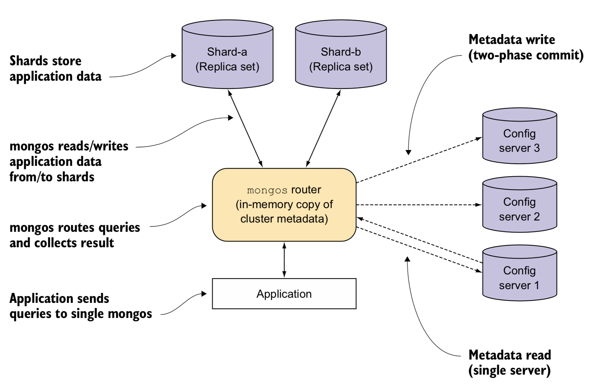

# Author

Thiago Alexandre Domingues de Souza

# Table of Contents

- [NoSQL](./01-NoSQL.md)
- [MongoDB](./02-MongoDB.md)
- [Mongo Shell](./03-Mongo%20Shell.md)
- [CRUD](./04-CRUD.md)
- [Indexes](./05-Indexes.md)     
- [Data Modeling](./06-Data%20Modeling.md)
- [Aggregation](./07-Aggregation.md)
- [Replication](./08-Replication.md)
- **[Sharding](#sharding)**
  * **[Chunks](#chunks)**
  * **[Shard Keys](#shard-keys)**
  * **[Queries in a Sharded Cluster](#queries-in-a-sharded-cluster)**  
  * **[Configuring a Sharded Cluster](#configuring-a-sharded-cluster)**
  * **[Playing around](#playing-around)**
- [Server Tools](./10-Server%20Tools.md)
- [Storage Engines](./11-Storage%20Engines.md)
- [References](./README.md#references)

# Sharding

Sharding is the method of partitioning the data into chunks based on a *shard key*. Because each chunk has a lower and upper ranges based on the *shard key*, different chunks cannot have the same data. This process enables using commodity hardware to scale out the application rather than increasing the capacity of a single server (a.k.a. vertical scaling). Building a *sharded cluster* requires careful planning and should be used with very large data sets that could not be managed without partitioning. Because a sharded cluster may have non-sharded collections, MongoDB defines the shard with least amount of data as *primary shard* to store all non-sharded collections.

A *sharded cluster*, illustrated in Figure 3, comprises three components:


- **Shard:** starting in version 3.6, shards must be configured as *mongod* replica set to store partitions. Clients should not connect to shards directly because it does not have all the data.
- **mongos:** *mongos* caches config servers' metadata and routes reads/writes to the appropriate shard. As a result, it represents the front door to client requests. Because *mongos* processes are lightweight, they can be deployed together with the application server to deliver a higher throughput.
- **Config servers:** they are *mongod* processes that store the cluster metadata, including databases/collections locations, the list of chunks on every shard and their ranges, authentication configurations, etc. Writes to config servers take place as result of a metadata change like a chunk migration or a chunk split, and it uses a majority write concern to ensure a cluster-wide durability, whereas reads are performed to authenticate users and send the metadata to *mongos* router, and uses a majority read concern. In case the primary config server replica set becomes unavailable and cannot elect a new primary, the metadata becomes read-only. As a result, chunk migrations or splits will not execute. In addition to that, the sharded cluster may not work if all config servers are unavailable.


<p align="center">
 <br>
<b> Figure 3: </b> Sharded Cluster Components  <a href="./README.md#references">(4)</a> </p>


## Chunks

A chunk contains a subset of the data based on the shard key. When an insert or update makes the chunk exceed the default  size of 64 Mb, it triggers a split process to divide it into smaller chunks. A split is an efficient metadata process but does not affect the shards, the balancer automatically migrates chunks across shards to better distribute them. It's possible to modify the chunk size, but the frequency of migrations and the impact on queries executed should be monitored. There are some circumstances that chunks can grow beyond the size limit. That usually happens when the chunk has a single shard key that cannot be split, and this behavior can impact the performance and the scalability if it continues to increase.

The balancer is a background process that runs on the primary of the config server replica set and distributes chunks across shards, so they are evenly divided to avoid overloading a single shard. Because migrations move data between shards, they are very expensive and it can impact the performance of the database, but it does not prevent reads or writes.

## Shard Keys

Shard key values are immutable, once a collection is loaded, the shard key cannot be modified. Because they determine the chunk that will be store the data, a bad decision makes a difference between achieving a high performance or not. For example, writing only ascending shard keys will produce unbalanced chunks, overloading the last chunk and making MongoDB to split it into smaller chunks and then migrating them to other shards. Alternatively, if the shard key is coarsed grained, it will not be possible to split the chunk and spread them across different shards because each shard key must be stored in a single chunk. In addition to that, if the shard key is not in the query, MongoDB will request all shards to perform the operation without benefiting from a targeted query. 

Choosing a good shard key can be complicated because it has to ensure that reads target appropriate shards, writes are balanced across shards, and splits/migrations can occur appropriately. To evaluate a shard key, investigate how the  cardinality, frequency, and rate of change can influence its efficiency. Cardinality refers to the number of distinct shard keys, meaning that a high cardinality shard key does not guarantee an even distribution of data across shards, but allows scaling out. Frequency describes how often a shard key is present, and high frequency shard keys should be avoided because they cannot be partitioned. Finally, the rate of change defines if the shard key increases or decreases monotonically, not distributing the data evenly.

All sharded collections must have an index on the shard key or a compound index with the shard key as prefix. If the collection is empty, the function *sh.shardCollection()*  creates an index on the shard key if it does not exist, otherwise, if the collection is loaded, the index must be created before running the *sh.shardCollection()*. It's important to note that sharded collections only allow unique indexes on the *_id* and on the shard key, because allowing on other fields would require an inter-shard communication.

## Queries in a Sharded Cluster

Querying a sharded or a non-sharded collection is equivalent in terms of the syntax. However, CRUD operations require some understanding about *mongos* routing to take advantage of all computing power available in a sharded cluster. If *mongos* can determine the shard key, the operation is routed to the targeted shard, otherwise, the operation is broadcasted to all shards and then  the results are merged to the client. Writing a new document must include the shard key, and it throws an error otherwise. The methods *insertOne* and *insertMany* target a single shard based on the shard key. Obviously, depending on the shard key used in  *insertMany*, it may write into different shards. For *updateOne*, *replaceOne*, and *deleteOne* the query must include the shard key or the *_id*, otherwise an error is returned.

Modifiers such as *sort*, *skip*, and *limit* have a particular behavior in sharded collections. If the query has a *sort* function, shards sort intermediate results and the primary shard runs a merge sort with all documents. When *limit* is used, each shard limits the number of results and *mongos* limits the final result. For *skip*, shards return all results and *mongos* skip the number of documents specified. Regarding indexes, queries on individual shards can be optimized to run index scans as if they were regular collections because each shard maintains its own indexes.

For aggregations, if the first pipeline is a *$match* on a shard key, all the pipeline runs on the matching shard. However, if the aggregation requires multiple pipelines, the results are addressed to a random shard that merge them, that way it avoids overloading the primary shard.

## Configuring a Sharded Cluster

Configuring a sharded cluster requires creating the shards and the config servers as *mongod* replica sets. After that, *mongos* processes should point to the config servers. Finally, the replica set shards should be added to the cluster using the command *sh.addShard*. To verify the sharding status, including the shards available, sharded collections, and chunks the function *sh.status* can be used. Before creating a sharded collection, it's required to enable sharding on the database using the *sh.enableSharding* function. The *sh.splitAt* function splits a chunk manually using the shard key provided.

```
$ mkdir /data/{rs-a-1,rs-a-2,rs-a-3}
$ mkdir /data/{rs-b-1,rs-b-2,rs-b-3}
$ mkdir /data/{config-1,config-2,config-3}
$ mkdir /data/logs

$ mongod --shardsvr --replSet shard-a --dbpath /data/rs-a-1 --port 3001 --logpath /data/logs/rs-a-1.log --fork 
$ mongod --shardsvr --replSet shard-a --dbpath /data/rs-a-2 --port 3002 --logpath /data/logs/rs-a-2.log --fork
$ mongod --shardsvr --replSet shard-a --dbpath /data/rs-a-3 --port 3003 --logpath /data/logs/rs-a-3.log --fork

$ mongod --shardsvr --replSet shard-b --dbpath /data/rs-b-1 --port 3004 --logpath /data/logs/rs-b-1.log --fork
$ mongod --shardsvr --replSet shard-b --dbpath /data/rs-b-2 --port 3005 --logpath /data/logs/rs-b-2.log --fork
$ mongod --shardsvr --replSet shard-b --dbpath /data/rs-b-3 --port 3006 --logpath /data/logs/rs-b-3.log --fork

$ mongo --port 3001
> rs.initiate( { _id : "shard-a",
                members : [ { _id : 1, host : "localhost:3001" },
                            { _id : 2, host : "localhost:3002" },
                            { _id : 3, host : "localhost:3003", arbiterOnly : true } ] } )
> exit

$ mongo --port 3004
> rs.initiate( { _id : "shard-b",
                 members : [ { _id : 1, host : "localhost:3004" },
                             { _id : 2, host : "localhost:3005" },
                             { _id : 3, host : "localhost:3006", arbiterOnly : true } ] } )
> exit

$ mongod --configsvr --replSet config --dbpath /data/config-1 --port 4001 --logpath /data/logs/config-1.log --fork
$ mongod --configsvr --replSet config --dbpath /data/config-2 --port 4002 --logpath /data/logs/config-2.log --fork
$ mongod --configsvr --replSet config --dbpath /data/config-3 --port 4003 --logpath /data/logs/config-3.log --fork

$ mongo --port 4001
> rs.initiate( { _id : "config",
                 members : [ { _id : 1, host : "localhost:4001" },
                             { _id : 2, host : "localhost:4002" },
                             { _id : 3, host : "localhost:4003" } ] } )
> exit

$ mongos --configdb config/localhost:4001,localhost:4002,localhost:4003 --port 5000 --logpath /data/mongos.log --fork

$ mongo --port 5000
> sh.addShard("shard-a/localhost:3001,localhost:3002")
> sh.addShard("shard-b/localhost:3004,localhost:3005")
> sh.enableSharding("mydb")
> sh.shardCollection("mydb.users", { username : 1, _id : 1,  } )
> for(i=1; i<10000; i++){
    db.users.insertOne( { username : "user"+i })
  }
> sh.splitAt( "mydb.users", { "_id" : ObjectId("5bc8f8673c6cb9da4ec6088e"), "username" : "user5000" } )
> sh.status()
--- Sharding Status --- 
  sharding version: {
  	"_id" : 1,
  	"minCompatibleVersion" : 5,
  	"currentVersion" : 6,
  	"clusterId" : ObjectId("5bc8eb65acc984c7f94ff30d")
  }
  shards:
        {  "_id" : "shard-a",  "host" : "shard-a/localhost:3001,localhost:3002",  "state" : 1 }
        {  "_id" : "shard-b",  "host" : "shard-b/localhost:3004,localhost:3005",  "state" : 1 }
  active mongoses:
        "3.6.5" : 1
  autosplit:
        Currently enabled: yes
  balancer:
        Currently enabled:  yes
        Currently running:  no
        Failed balancer rounds in last 5 attempts:  0
        Migration Results for the last 24 hours: 
                1 : Success
  databases:
        {  "_id" : "config",  "primary" : "config",  "partitioned" : true }
                config.system.sessions
                        shard key: { "_id" : 1 }
                        unique: false
                        balancing: true
                        chunks:
                                shard-a	1
                        { "_id" : { "$minKey" : 1 } } -->> { "_id" : { "$maxKey" : 1 } } on : shard-a Timestamp(1, 0) 
        {  "_id" : "mydb",  "primary" : "shard-b",  "partitioned" : true }
                mydb.users
                        shard key: { "username" : 1, "_id" : 1 }
                        unique: false
                        balancing: true
                        chunks:
                                shard-a	1
                                shard-b	1
                        { "username" : { "$minKey" : 1 }, "_id" : { "$minKey" : 1 } } -->> { "username" : "user5000", "_id" : ObjectId("5bc8f8673c6cb9da4ec6088e") } on : shard-a Timestamp(2, 0) 
                        { "username" : "user5000", "_id" : ObjectId("5bc8f8673c6cb9da4ec6088e") } -->> { "username" : { "$maxKey" : 1 }, "_id" : { "$maxKey" : 1 } } on : shard-b Timestamp(2, 1)
```

Switching to the config database from *mongos* displays the metadata collections used by the config server:

```
mongos> use config
mongos> show collections
actionlog
changelog
chunks
collections
databases
lockpings
locks
migrations
mongos
shards
tags
transactions
version

mongos> db.chunks.findOne({_id : /mydb/})
{
	"_id" : "mydb.users-username_\"user5000\"_id_ObjectId('5bc8f8673c6cb9da4ec6088e')",
	"lastmod" : Timestamp(2, 1),
	"lastmodEpoch" : ObjectId("5bc8f84bacc984c7f950310d"),
	"ns" : "mydb.users",
	"min" : {
		"username" : "user5000",
		"_id" : ObjectId("5bc8f8673c6cb9da4ec6088e")
	},
	"max" : {
		"username" : { "$maxKey" : 1 },
		"_id" : { "$maxKey" : 1 }
	},
	"shard" : "shard-b"
}

mongos> db.shards.findOne()
{
	"_id" : "shard-a",
	"host" : "shard-a/localhost:3001,localhost:3002",
	"state" : 1
}
```

## Playing around

Creating a shard collection:

```
mongos> db.test1.drop()
mongos> db.test1.createIndex({a: 1, b : 1})
mongos> db.test1.insert({a : 100, b : 200})

// error: collection is not empty, so shard key must be a prefix of an existing key
mongos> sh.shardCollection("mydb.test1", {b : 1})

// correct: the shard key "a" is a prefix of the existing index
mongos> sh.shardCollection("mydb.test1", {a : 1})


mongos> db.test2.drop()
// correct: collection is empty, so command creates an index on the shard key
mongos> sh.shardCollection("mydb.test2", {c : 1})
mongos> db.test2.getIndexes()
[
	{
		"v" : 2,
		"key" : {
			"_id" : 1
		},
		"name" : "_id_",
		"ns" : "mydb.test2"
	},
	{
		"v" : 2,
		"key" : {
			"c" : 1
		},
		"name" : "c_1",
		"ns" : "mydb.test2"
	}
]

mongos> db.test3.drop()
mongos> db.test3.createIndex({ a: 1 })
mongos> db.test3.createIndex({ b: 1 }, { unique : true })

// error: collection cannot have a unique index other than the _id or the shard key
mongos> sh.shardCollection("mydb.test3", {a : 1})

// correct: shard key allows a unique index
mongos> sh.shardCollection("mydb.test3", {b : 1})


mongos> db.test4.drop()
mongos> db.test4.createIndex({ a: 1, b : 1}, { unique : 1 })
// correct: it can use the prefix of a unique key
mongos> sh.shardCollection("mydb.test4", {a : 1})
```

Queries:

```
mongos> db.person.drop()
mongos> sh.shardCollection("mydb.person", { name : 1, ssn : 1})
mongos> db.person.insert({ _id : 1, name : "john", ssn : 123, age : 30, city : "New York" })
mongos> db.person.insert({ _id : 2, name : "peter", ssn : 456, age : 35, city : "Philadelphia" })
mongos> db.person.insert({ _id : 3, name : "alex", ssn : 789, age : 21, city : "Los Angeles" })

// error: insert must include the complete shard key
mongos> db.person.insert({ age : 27, city : "Miami"})


// error: shard key is immutable, so the value cannot be modified
mongos> db.person.update({ _id : 1 }, { $set : { name : "JOHN" }})

// error: shard key is immutable, so the value cannot be modified
mongos> db.person.update({ _id : 1 }, { $set : { ssn : 234 }})

// correct: city is not the shard key
mongos> db.person.update({ _id : 1 }, { $set : { city : "Los Angeles" }})

// error: a single update on a sharded collection must contain an exact match on _id or contain the shard key 
mongos> db.person.update({ age : 30 }, { $set : { city : "Houston" }})

// correct: multi update does not need the _id or the shard key
mongos> db.person.update({ age : 30 }, { $set : { city : "Houston" }}, { multi : true })

// correct: multi update does not need the _id or the shard key
mongos> db.person.updateMany({ age : { $gte : 30 }}, { $inc : { age : 1} })


// error: single delete on a sharded collection must contain an exact match on _id or contain the shard key 
mongos> db.person.deleteOne({ age : { $gte : 30 } })

// correct: single delete contains an exact match on _id or contain the shard key 
mongos> db.person.deleteOne({ _id : 1})

// correct: single delete contains an exact match on _id or contain the shard key 
mongos> db.person.deleteOne({ name : "peter", ssn : 456})

// correct: remove does not need the _id or the shard key because it can remove multiple documents
mongos> db.person.remove({ city : "Los Angeles"  })
```
